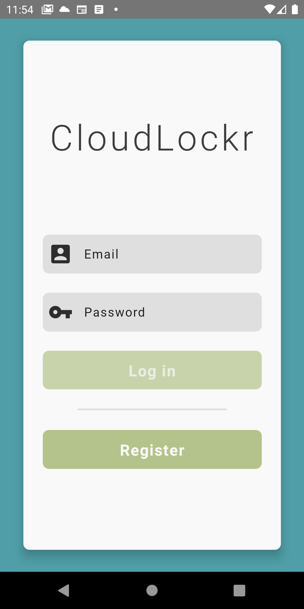
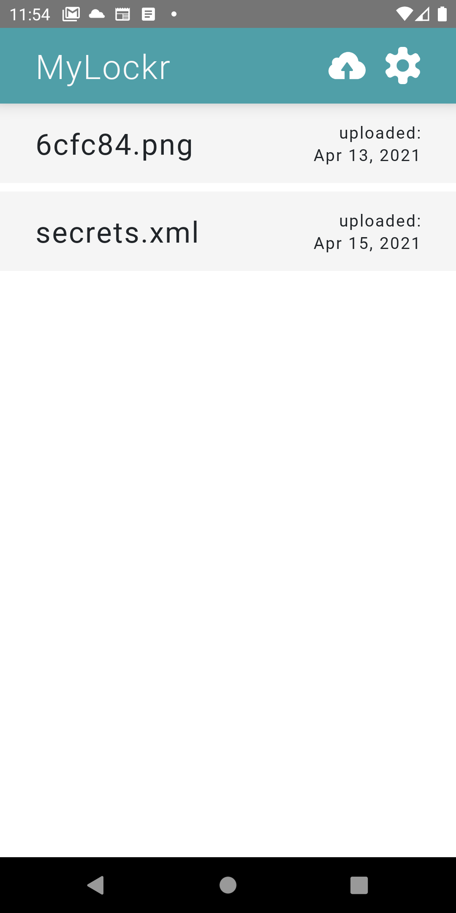

# CloudLockr -- Android App

## Project Overview

CloudLockr is an innovative data storage system, tieing your digital data to a physical location while providing secure remote backup storage. The 7 strong layers of protection CloudLockr offers ensures your data is never compromised or read by anyone else, including us.

This repo contains the Android application facilitating the CloudLockr device user interface. This codebase features custom bluetooth communication protocols, API integration, file reconstruction, and user management.

#### Demo (note: lower FPS than actual):

#### Screenshots

|                                 |                                 |                                 |                                 |
| :-----------------------------: | :-----------------------------: | :-----------------------------: | :-----------------------------: |
|  |  |  |  |

#### Main Technologies

- React Native
- Jest (testing)
- Axios (remote API connection)
- Redux (data storage)
- react-native-bluetooth-classic (bluetooth communication)
- react-native-fs (file system interaction)
- react-navigation (view navigation)

---

## Execution Details

#### Project Requirements

- npm
- yarn (latest)

#### How to Simulate on an Android Virtual Device (AVD)

1. Execute `yarn install` (if you have not already)
2. Launch an AVD emulator (Pixel 3 API 29, Android 10.0) using Android Studio in the Android Virtual Device Manager window
3. In a terminal window in the project root directory, execute `yarn start`
   - This will start the React Native Metro server
4. In a different terminal window also in the project root directory, execute `yarn android`
   - This will load the app onto the running AVD emulator

**Note:** All features related to bluetooth communcation within the app will likely not be usable as they require communicating through the phone's bluetooth hardware to the CloudLockr device. To test the app with mocked bluetooth connection, set `mocking.deviceConnection = true` in `src/Config/index.js`.

#### Running Tests

Execute `yarn test` to run the entire test suite (UI and service logic tests). Verbose results are enabled by default for result clarity.
